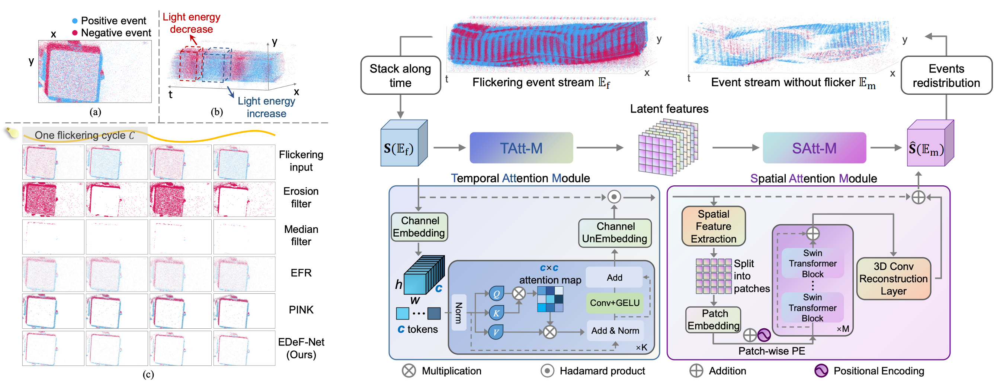
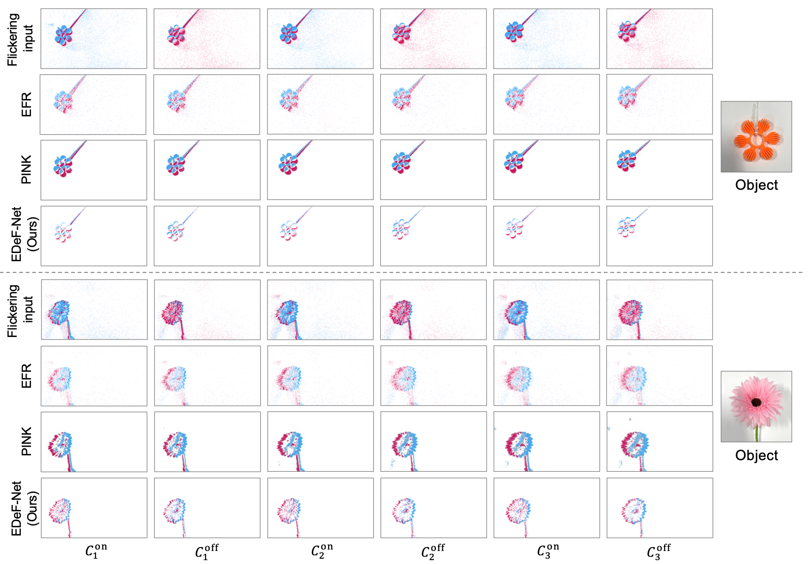

# EDeF-Net: Spatio-temporal Association Network for Flicker Removal in Event Streams

This is the official PyTorch implementation of the paper **"EDeF-Net: Spatio-temporal Association Network for Flicker Removal in Event Streams"** (ACM MM 2025).

[[Paper link]](https://pub-e7bc7e5ed67b401a8e9e587c3dee22b6.r2.dev/publications/2025/Han_MM25.pdf)

---

## 📌 Overview



Event cameras with bio-inspired neuromorphic sensors are highly sensitive to brightness changes. When there are moving objects in a scene under constant lighting, event cameras only record motion information and output a sequence of events asynchronously. However, the common flickering light sources, such as fluorescent or LED lamps powered by alternating current exist in various realworld scenarios. When operating under a flickering light source, event cameras output numerous redundant event signals that are triggered by the flickering effect, which overwhelm the useful signals that encode motion information. In this paper, we propose EDeF-Net, an Event streams DeFlickering Network that effectively leverages the spatio-temporal correlation of event streams by modeling both the inter-channel temporal attention and inter-patch spatial attention. To facilitate network training and evaluation, we synthesize the first dataset containing paired flickering and flickerfree event streams. Moreover, we demonstrate that event streams f iltered by EDeF-Net yield performance improvements on downstream applications such as event-based optical flow estimation and object tracking.

---

## 💡 Key Features

- **Effective De-flickering**: Successfully separates and removes AC light flicker from real motion events.
- **Spatio-Temporal Modeling**: Novel attention mechanisms specifically tailored for event stream structures.
- **Downstream Boost**: Significantly improves the performance of subsequent tasks like event-based optical flow estimation and object tracking.
- **Versatile Evaluation**: Validated thoroughly on both synthetic and real-world datasets.

---

## 🛠️ Installation

### 1. Clone the repository:

```bash
git clone https://github.com/hjynwa/EDeF-Net.git
cd EDeF-Net
```

### 2. Set up the environment:

```bash
conda create -n edefnet python=3.9
conda activate edefnet
pip install -r requirements.txt
```

---

## 💻 Usage

### 1. Dataset Preparation

- Download the synthetic dataset from [here](https://1drv.ms/u/c/9b45f60419226149/IQDowI9iboHcRr15G0SnzO77AVLW6kb7dg5nafJcw87GvX0) and put it to ```./dataset```.

- Download the real data samples from [here](https://1drv.ms/f/c/9b45f60419226149/IgDdJkjQp7A-RIs6cwkXZUDoAeu7Og6kEQ9ePdcz3XsCYpc?e=emeeY1).

### 2. Training

- To train EDeF-Net from scratch:

  ```bash
  python train.py --config configs/config.json
  ```

### 3. Test / Evaluation on Synthetic Dataset

- To test on synthetic dataset using a pretrained model:

  ```bash
  python test.py --config configs/config.json --resume ckpt/checkpoint-epoch60.pth
  ```

### 4. Inference on Real Data Samples
- Split and convert event streams file from ```.csv``` (or ```.raw``` / ```.txt```) to sequence of event stacks in the format of ```.npy```. You can optionally extract part of the event streams by setting the ```--start_time``` and ```--end_time```. 

  ```bash
  python scripts/split_realdata.py --input_dir realdata_samples/realdata_flower/streams --output_dir realdata_samples/realdata_flower/evs_stack --start_time START_TIMESTAMP --end_time END_TIMESTAMP --height 360 --width 640
  ```

- Run inference on flicker event stacks using a pretrained model:

  ```bash
  python infer.py --config configs/config.json --resume ckpt/checkpoint-epoch60.pth --data_dir realdata_samples/realdata_flower/evs_stack
  ```

---

## 🖼️ Results

- Visualization of flicker removal results on real event streams.


- Download the results of [Synthetic testset](https://1drv.ms/f/c/9b45f60419226149/IgDufiJDcaq1QoRVhIX1CoQNAefa9oo5_-D2yo4ZxmmVgH4?e=CmENYH) and [Real data samples](https://1drv.ms/f/c/9b45f60419226149/IgB8jzc66cs8TavziT-vijAfARrZ0vOzn7OZMkAalKRc03I?e=wWqTHp).

---

## 🔗 Citation

If you find our work or code helpful for your research, please cite our paper:

```bibtex
@inproceedings{han2025edef,
  title={EDeF-Net: Spatio-temporal Association Network for Flicker Removal in Event Streams},
  author={Han, Jin and Yang, Yixin and Zhan, Zhan and Shi, Boxin and Sato, Imari},
  booktitle={Proceedings of the 33rd ACM International Conference on Multimedia},
  pages={229--237},
  year={2025}
}
```

---

## 📜 License

This project is licensed under the MIT License - see the [LICENSE](https://www.google.com/search?q=LICENSE) file for details.
